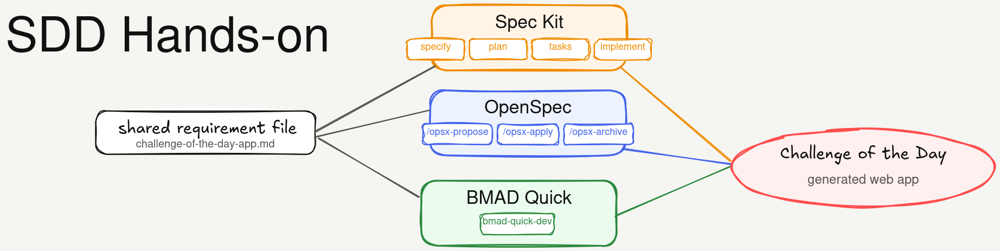

# SDD Hands-on

<p align="center">
  <a href="README.pt-BR.md">🇧🇷 Português</a>
  ·
  <a href="README.en.md">🇺🇸 English</a>
</p>




Este repositório reúne experimentos com três abordagens de **desenvolvimento guiado por especificações** (*Spec-Driven Development*, SDD), aplicadas à geração de uma aplicação web simples.

A aplicação usada como referência é o **Desafio do Dia**, uma pequena aplicação para apresentar desafios diários de programação.

O repositório contém requisitos, scripts de configuração, documentação e os arquivos resultantes gerados durante os experimentos. Também pode ser executado em um **GitHub Codespace**.

## Experimentos

| Pasta | Método | Objetivo |
|---|---|---|
| `examples/01-speckit` | Spec Kit | Gerar a aplicação usando o fluxo do Spec Kit |
| `examples/02-openspec` | OpenSpec | Gerar a aplicação usando OpenSpec com OpenCode |
| `examples/03-bmad-quick` | BMAD Quick | Gerar a aplicação usando o fluxo rápido do BMAD |

O arquivo de requisitos compartilhado está em:

```text
examples/shared/requirements/challenge-of-the-day-app.md
```

## Estrutura do repositório

```text
.
├── devcontainer.json
├── scripts/
│   ├── check-env.sh
│   └── init-speckit-project.sh
├── docs/
│   ├── README-speckit.md
│   ├── README-openspec.md
│   └── README-bmad.md
└── examples/
    ├── 01-speckit/
    ├── 02-openspec/
    ├── 03-bmad-quick/
    └── shared/requirements/
```

## Executando no Codespaces

Este repositório inclui uma configuração de ambiente de desenvolvimento, permitindo sua execução diretamente no **GitHub Codespaces**.

O ambiente inclui ferramentas básicas para os experimentos, como Node.js, Python, Git, GitHub CLI, OpenSpec e extensões úteis para Copilot, JSON e Mermaid.

## Verificando o ambiente

Execute:

```bash
./scripts/check-env.sh
```

O script verifica as principais ferramentas usadas no hands-on e apresenta instruções de instalação quando algo está faltando.

## Observações

Este repositório é exploratório. O objetivo não é apresentar uma aplicação final polida, mas comparar como diferentes ferramentas de SDD estruturam requisitos, planejamento, artefatos gerados e tentativas de implementação.
